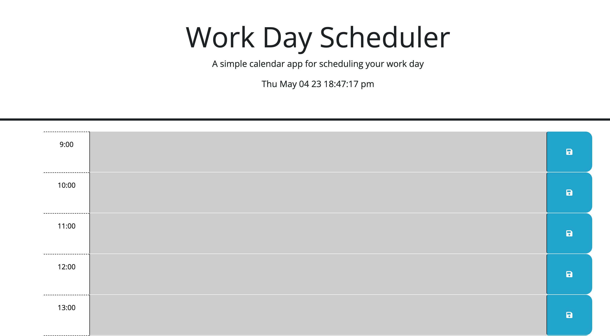

# myCal
Jquery calendar
## Table of Contents

* [Description](#description)
* [Links](#links)
* [Purpose](#purpose)
* [Screenshots](#screenshots)
* [Technologies Used](#technologies)
* [Licence](#license)
* [Credits](#credits)
## Description

Jquery based Calendar with color coded past present and future events

## Links
https://crisesaverting.github.io/myCal/

## Purpose

Jquery day planner.

## Screenshots

## Technologies

## License

## Credits
Some of these materials were developed by the 2U/edX Coding Curriculum Team for use with bootcamp students.